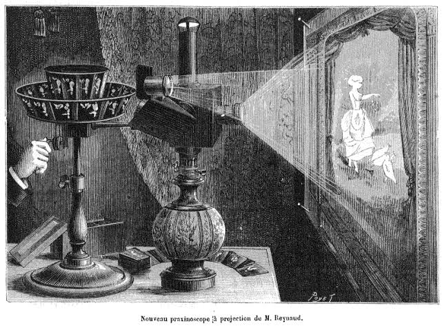
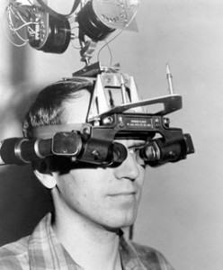
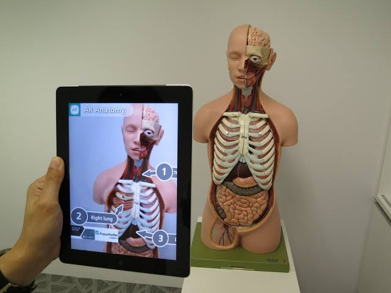
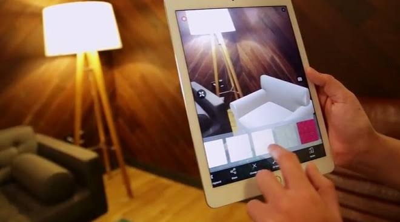

We know about Virtual Reality and how it allows us to experience a completely different world, a "virtual" world of sorts. Augmented Reality, on the other hand, adds to our material surroundings. So how are AR and VR related? Lets have a look about AR and VR in this article.

<!--more-->

# Stepping into the awe-inspiring world of Augmented Reality aka AR

We all have seen Tony Stark gesturing around on a projection in real-time in a lot of Marvel movies. There are plenty of other Sci-Fi movies which have shown AR technology. But unlike another Sci-Fi tech like flying cars which have not been realized yet, AR has been around in real life for quite some time, and it is only now that it has finally made its entry in our daily lives. But what exactly is Augmented Reality?

## Augmented Reality: What's all the buzz about?

We know about Virtual Reality and how it allows us to experience a completely different world, a "virtual" world of sorts. Augmented Reality, on the other hand, adds to our material surroundings. So how are AR and VR related? The answer is that they are two different concepts on a common spectrum. To understand AR, we have to understand the spectrum.

Our physical body existing in real space and time is what we perceive as 'reality'. 
Virtual Reality is when we are submerged in a fabricated environment completely different from our own. VR games are the best example where it feels as if the player is in the fantasy game world. Augmented Reality (AR) on the other hand is just what its name suggests, a middle state between the real world and virtual reality. It "augments" the "reality" adding virtual elements to it.

In Virtual Reality, you would see a completely different world which requires you to put on special VR glasses. It makes you unaware of your immediate surroundings. However, with Augmented Reality, you don't necessarily have to wear glasses to cut you off from the real world. AR is used to build on to your reality by adding virtual elements to it, as mentioned earlier.

You can think of it as the projection of a video clip on a plane wall like they did in old times. 

Only AR is more detailed in the sense that it has all the elements of your real surroundings but it adds extra images and information to help you. For example, you are traveling to a foreign country and come across a beautiful monument but you don't know its name. You can just point your phone camera towards it and an app based on AR might tell you the details about the monument. Or, if you're off to buy groceries and the signs are in the native language which you don't understand, there are AR based translation apps available which will translate these signboards in real-time for you.

These are only a few among a whole range of use-cases of AR-based tech. We'll discuss more in a bit.

### Where did AR come from?

As high tech as it might sound, AR has existed for a long time. In 1965, Ivan Sutherland proposed an "ultimate display" which was realized in 1968. It was a big "head-mounted display" (HMD) which was so heavy it had to be hung from the ceiling on the user's head. And thus was nicknamed the Sword of Damocles.

AR and VR were hence born and used only for academic purpose until ARtoolKit in 1999.
ARtoolkit was the first-ever open-source AR platform which featured a 3D tracking library using black-and-white fiducial markers, which could be printed on a regular printer.

### AR is all around us

You might be surprised to know how common AR is. We all have heard of the popular game Pokemon Go and what a sensation it was. You could walk around in your neighborhood with your phones and catch some Pokemons. The game showed us all what an interesting difference a few virtual elements added to current reality can make.

AR has found its way in a lot of different industries such as entertainment, healthcare, furnishing, etc. And it is a very promising one too.

The new Snapchat filter that lets your Bitmoji dance around in your room is a result of AR.
In the field of healthcare, AR technology can prove to be efficient to give extra information on human anatomy.

Many home furnishing apps have used AR to show you how a type of furniture would look in your house. You can just point your phone camera towards an empty room and it'll show you what your desired furniture would look like in that place.

It can even be used for selecting clothes for yourself without having to try them on thus saving you a trip to the mall.

Now imagine, there's a building under construction but it is deteriorating. AR gear can be used in this situation for a walk-through of the sight without endangering the worker's life.

## What is the future of AR?

Experts have claimed that by 2025, the AR/VR industry will be worth 25 billion dollars. Earlier, AR was associated with bulky headgears and meshes of tangled wires. With the evolution of science and technology over the past years, all this complexity has been brought down to a 5-inch device which hardly weighs a couple of hundred grams... smartphones! Viewing an AR version of our surroundings is now as simple as firing up an application and pointing your phone camera at the target object.

This has not only made AR more reachable by the general masses but also opened up endless avenues, and with billion-dollar companies like Facebook investing in it, it goes without saying that the future of AR/VR is an upward slope of progress.