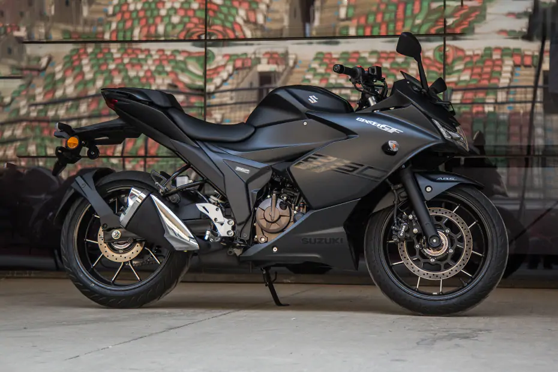

Following my somewhat [life-changing journey to Rishikesh](https://rishabh1403.com/posts/travel/2019/11/trip-to-rishikesh), a lot of things turned out
in ways I hadn't expected. Moving to another place, settling down in Delhi with
family (trust me it's temporary :relieved:), and buying a new bike. Yes!!! bought a new
bike in August'19 :bike:. This post is all about the time *I bought my first new bike*:confetti_ball:.

<!--more-->

# Perfect excuse

I was feeling restless ever since I went to [Rishikesh](https://rishabh1403.com/posts/travel/2019/11/trip-to-rishikesh). I wanted a bike and to go
on a long ride every week. I wanted to feel the same freedom again :stuck_out_tongue:. It all
seems so perfect in theory but in practice, things are a tad bit complicated. I
had a new job that I liked, had just settled down in Delhi and was out
of cash. So I thought of delaying my bike for a couple of months.

My new place was quite far from office and hence I ended up paying a lot in
commute every day. Both time:clock1: and money:moneybag:. I started feeling exhausted very soon
and this was my perfect excuse to buy a new bike. I asked my mother, she said
"Hell, No!!!". I heard "Hell, Yeah!!!":stuck_out_tongue:. 

# Perfect bike

Hence, the search began for the perfect bike. I had a budget, didn't want
something too powerful and heavy (since this was my first), didn't want
something too light and slow so that I don't lose interest in few months:disappointed:. After
a lot of research (ahem...ahem:books:), I settled on ***[Bajaj Dominar](https://www.bajajauto.com/motor-bikes/dominar-400/home)***. It was
fairly new to the
market with good reviews and it wasn't very costly. I was almost about to buy it, and then
my friend Nimish suggested something. ***[Suzuki Gixxer 250 SF](https://www.suzukimotorcycle.co.in/product-details/gixxer-sf-250)***. 

It was so beautiful, in my budget and the best thing about it, it was
Matte Black:heart:. It was perfect, however, Dominar had more power and had good presence throughout the country making it easier to maintain. I was
confused between the two of them. I didn't know much about bikes then and knew no one
in the city in my circle who did. We planned to go and take a test ride the
following Sunday.

I was too excited to wait for Sunday and went all by myself on
Saturday for a test ride. It felt sooo good. I fell in love with it
immediately:heart::heart:. I requested Nimish to come and take the bike delivery at the very same
moment. When he arrived, he looked surprised that I expedited the process, but
supported my anyways. When it was time to pay for the bike, my credit card
didn't work:cry:.

# My new bike

I started counting cash and fell short by a good amount. I requested Nimish
to help me with the cash, and he helped me with everything he had. I mean
every single penny!!!. At last, we managed to pay and take the bike. I wish I had
pictures to put here, but at that moment, I was shaking with excitement and
didn't bother to click any. 

We took the bike and were on our way. Can you believe I almost dropped it on our
way back? I mean, it should'nt be a surprise, I wasn't very good at riding bikes, and this was
the heaviest one I had ever driven. Well, I made it home. Oh, no!!! I was
home...with the bike. Mom!!!:cold_sweat:

# The excitement

I parked the bike in the basement and went home. I was acting like I had a very
normal day. Soon, I couldn't resist it anymore and told mom about the bike.
Thankfully, she didn't freak out, else *I would've been history*:trollface:. She took a look
at it and said: "It's a sports bike, I am not sitting on it". Somewhere I felt
relieved:relieved:. Think about this, me riding a sports bike at *20kmph*, with my mom on
the back seat, even the thought of it made me terrified. But, finally, it was
done, I had a bike!!!. I couldn't sleep that night.

Well, that's the story of how I bought my first bike. Stay tuned for my next
bike on ***17th August 2021***. Yeah, I have selected the date and shortlisted two
new bikes. Yup, I'm crazy.
That's it for this one guys, stay tuned and I'll see you around.