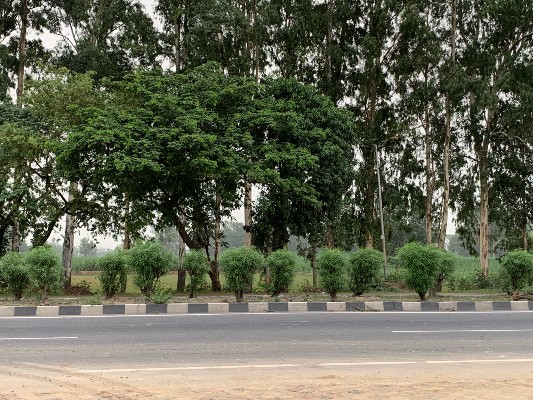
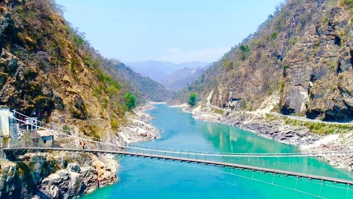
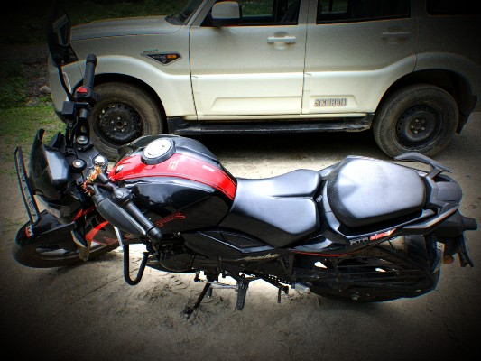
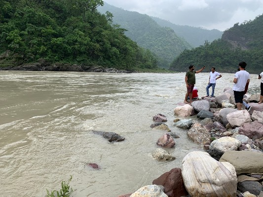
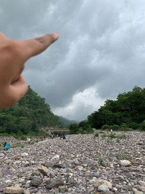
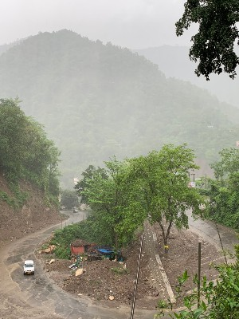
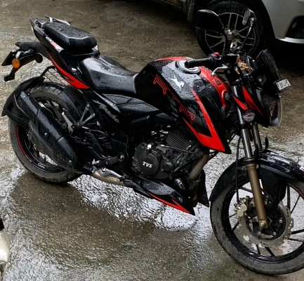
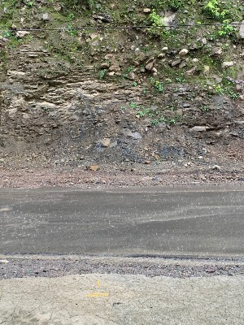
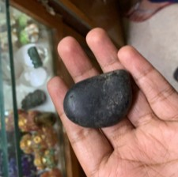
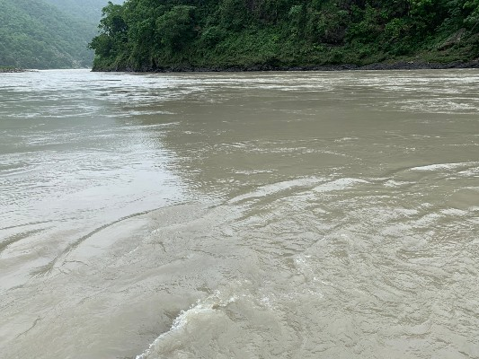

Where it all started!!!. I think this is the best I can describe that journey. My first solo trip, 
my first trip in fact. I had never traveled before just for the fun of it. Every place I had visited earlier was either for work or family obligations. This was my first trip for fun, for leisure, for me. My solo one day trip to Rishikesh.

<!--more-->
# The Plan

It was around 4 p.m. on Saturday, July 13th. I was bored the hell out of life after spending about 6 months in Gurgaon. All my friends were in Bangalore (that's another story in itself...my move from Bangalore to Delhi). I was crying my eyes out and reached out to my friend [Shubham](https://www.instagram.com/chandakbiryani/) (who is also an avid traveler and foodie). I asked him about the places I can visit for a day and he suggested Rishikesh. He started helping me out with buses and hostels and before I knew it, my bus leaves in 3 hours. I packed a couple of stuff and left in shorts and flip flops (wrong decision :stuck_out_tongue:). I had booked a hostel for the day and took note of a list of places which he suggested me to visit. Thus, I had a plan for a day-long solo trip and boarded the bus towards a journey that was going to change my life for good.

# The shock

I got down from the bus around 8 a.m. Rishikesh was still 11kms from the bus stand. So took a public auto to the center of the city. The drive towards the city was refreshing. I was excited and a bit scared as it was my first solo trip. I had traveled solo first, but had friends and family in every one of those cities, but not this one. 

As the auto drove towards the city, it started to get crowded and more crowded. And when I was dropped off I found myself in complete chaos. The city was crawling with people. People everywhere. Shops everywhere. Things and shops crammed in small places. I felt suffocated in that environment. I went over to the river bank and people bathing there, noise, polluted river. It was all chaos. I didn't come all this way for this experience. It was horrible and was making me nauseous. 

# The breakthrough

I could see lush green mountains nearby. A river flowing parallel to the ranges and clear weather. I decided to rent a motorbike and go for a ride, for I had come for peace and not chaos. I found a renting shop nearby and took a bike on rent. 

I had in total of 500 kms of riding experience. I had learned how to ride quite recently and wasn't very comfortable on a bike. Also the mountains.... had never driven in a hilly area. So it brought its challenges. I finally rented a good bike. The moment I got on my bike, it felt so heavy. I was used to driving a lighter one, that too hadn't driven for around 6-7 months. I was a complete noob. Somehow I got the wheels rolling and in less than 5 minutes I was on the road. I asked someone for directions towards the hills and left the city for good. I felt free and this was a breakthrough in my biking journey, which was going to define a lot my future decisions. I was flying.

# The ride

Before I knew it, I was in the mountains. The roads were good, the mountains on one side and the river on the other. The wind hitting my face was nothing but pleasant. I felt happy and relaxed. I was enjoying the ride to its fullest and loved the bike. It was much refined than the one I owned and moved much faster :stuck_out_tongue:. While driving I saw some people near the riverbank, that too with cars. I knew there must be a way to reach there so decided to explore on my way back. 

After driving for about 50 km decided to turn back as I was on the clock. (1-day trip). I was hungry as last I ate was around 20 hours ago. I had almost forgotten to have breakfast or even lunch in the excitement of the ride. I took a pit stop, had some breakfast at one of the roadside eateries and continued on my journey. Finally, I found the road which took me towards the river bank and boy it felt so good to just stand beside flowing water.

# The scare

As I was sitting there, watching the river flow I heard a sound that I never wanted to hear in those circumstances. Rumbling clouds and lightning. Before I knew it, the sky turned dark and I got scared. I was inside the river and if I had stayed there amid rains, the river flow would have been too dangerous. 

I hurried back to my bike and tried to get out of the place as soon as I can, never looking back at the river. The moment I reached the road, it started raining heavily and I felt a sigh of relief and fear. I wasn't prepared for rains in my current attire and with limited riding experience. To escape I started driving fast as there was no shed nearby and I did something that was nothing but an achievement for me. Took a turn at the speed of 60kmph. At that moment I learned how to lean and control the bike on turns momentarily and everything turned out okay. I found a shed nearby and took shelter before I got too drenched.

# The freedom

As I was standing there waiting for the rains to stop, I felt freedom. I had a bike, but that was more or less a necessity as opposed to a hobby. For the first time, I looked at the bike as a hobby. Something that I knew I would always enjoy. Especially in these circumstances. I felt the urge to drive in the rains but held back as I was underprepared. It felt binding to me, but I knew biking is the means of freedom for me. 

After the rains had stopped I returned the bike to the renting shop and decided to explore the city for the rest of the day.

# The city

At that point, I had no intention of exploring the city, I knew what my heart wanted. But, I had recommendations from my [friend](https://www.instagram.com/chandakbiryani/) that I needed to explore. I visited a couple of places including a highly overrated cafe, a religious shop (to get something for mom) and a pawnshop to get something for my [friend](https://www.instagram.com/chandakbiryani/). I bought a couple of souvenirs for my [friend](https://www.instagram.com/chandakbiryani/) and mom and started enjoying the walk in the chaotic streets of Rishikesh.

All that time walking around on hilly roads didn't tire me. I am the complete opposite of what you'll call an athletic body but I was just loving the day so much. Suddenly chaos looked so beautiful. People looked so happy. The small shops looked so lively. Everything was just overwhelming. And before I know it, it was almost time to return. 

# Peace

It was around 2 hours before my bus departed. I spent the last hour sitting on the bank of the river. Just watching people coming there, praying, chilling, laughing and enjoying their evening. The whole experience was so calming. I looked at the river flowing steadily and it felt so soothing.

I didn't want to go back for I was having one of the best days of my life. At that moment I promised the city that I'll come back again and spend more time there. I will explore more things that I couldn't. It was dusk and before I knew it, I was on my way back to the bus.

# Return journey

The bus was around 2 hours late. I waited for the bus in the middle of nowhere in darkness while it was drizzling all the time. when I got on the bus, I was completely tired. I had a small chat with my [sensei](https://twitter.com/andrewlinfoot). Now I understood why he prefers experiences over materialistic pleasures and fell asleep :sleeping:. When I got up, the bus was almost 5 hours late and I reached home around 6 hours later than planned. All of this didn't bug me at all. I felt so calm and patient for I was at peace. 

# Lessons learned

I learned a lot of things that day
- I was in the wrong attire for a bike ride. A pair of flip flops and shorts aren't very safe :exclamation:
- Experiences give me more pleasure and happiness than materials
- it's good to disconnect from the ever-increasing tech world :computer:

and a lot more. So much that I was taking notes at different points in the trip :notebook_with_decorative_cover: :laughing:

# conclusion

To conclude this epic one day trip, I'll say this, don't ask me for places to visit in Rishikesh, because the honest answer is "I don't know". The bike trip was the biggest highlight of the trip and everything that followed felt good as it had set the tone for the day :bike:. I had found a new hobby, an even greater passion for traveling, and I had one of the best guides ever as my [friend](https://www.instagram.com/chandakbiryani/).