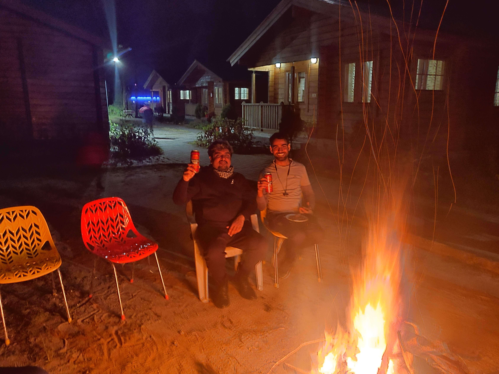

After a long wait, it was time for my first long ride. It wasn't very long to be
honest, just 682kms round trip, but for me, this was the longest I've ever
ridden a bike. The date we finalized was 9th-10th November'19 and the
destination was Lansdowne. It is a nice quiet place in the middle of nowhere on
a hilltop:sunrise_over_mountains:. Where there is a hill, we must take bikes. 

<!--more-->

# Delayed start

Driving on hills is always fun. Although it was my first time driving on hills,
I was confident I'll enjoy it a lot. Like all rides, we were scheduled to depart
around 6 am and ended up getting delayed by almost an hour. To my surprise,
Kartik didn't leave anyone behind this time, even when they were late. It seemed
like leaving behind the rule was only applicable for short rides. Anyways, we
started around 7 and I was too excited. I learned how to tie my luggage on a
bike using some youtube videos and it worked out decent enough. It was hard to
get on or get off the bike because of the tail luggage so I decided to not get
down from my bike at all(I was teased a lot about this later:stuck_out_tongue:). 

We crossed multiple cities, took a couple of small pee breaks along with a lunch
break. The food was nice and the weather was just perfect for a ride. I was
following almost all the rules of the group(I can't believe I was). I wasn't
very disciplined at that time(still working on it) but somewhere biking was making
me patient and disciplined. I started working out a bit, eating less junk and
started following a somewhat healthy lifestyle. Well, I am digressing, so where
was I, yes, the ride. It all went perfect until we reached the base of the
mountains.

# Hill climbing

Remember I said I was pretty confident about driving on hills, *I had
over-estimated myself a lot*. It was horrifying, and I started falling behind.
Before I knew, I went from tailing lead to the last position in the group. I
started having pains and wasn't able to keep up with the group. I was genuinely
scared, the roads were too steep and the hairpins looked very dangerous. To my
relief, Kartik came help and stayed on my tail to ensure I reach the destination
safely. 

The group took a small break but I was too uncomfortable to get down from the
bike. Everyone spent some time taking good pictures and we were on our way. We
reached our destination by 4 PM and it was almost dusk. When I got down from my
bike, I felt so relieved and my butt was numb. Everyone retired to their rooms to
freshen up followed by light snacks and some quality pictures.

# The bonfire

The Group had planned a bonfire:fire: in the evening which was fun. It was my
first ever bonfire in a group on a hilltop. It felt just like the movies. We
had snacks, drinks and a lot of music. Some people sang others told their stories
of older bike rides, travel, office jokes, and whatnot. I was mostly quiet
during the bonfire, but I was enjoying the evening a lot. It felt so peaceful.
The weather was cold, so the heat went very soothing and none of us
wanted to stay too far from the fire. We had an amazing evening followed by
dinner. After dinner, we went to bed, being tired from all day's journey and
knowing we had another full day of a ride ahead of us.

# The never ending photo session

We woke up pretty early the next morning(at least most of us did:stuck_out_tongue:). There's something
about the mountains, whenever I go there, I sleep better, wake up early and feel
refreshed all day. After tea and a heavy breakfast, it was time for a quick(not
so quick) photo session.

Someone said, "let's do a quick photo session for 10 minutes". It went on for
around an hour. There were people taking test rides of other's bikes, people
clicking selfies, revving the bikes, group pictures and all sorts of pictures.
There were people taking videos, suggesting places to stand and some of them
asking us to hurry so that we can leave on time(like that's even remotely
possible:laughing:). I sought out for help from others regarding tips on how to drive
downhill and my journey back was way better.

On our way back, we followed the same route, had lunch at the same place and
reached home around 9 o'clock safely after a 682km ride.

It was my first long ride, I felt so relaxed and as always was looking forward
to our next ride. We did many small rides and started planning for our next long
ride from thevery next day. 

That's it for this one guys, stay tuned and I'll see you around in the next one.